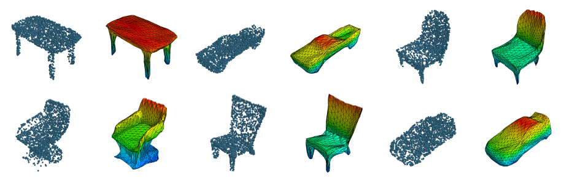
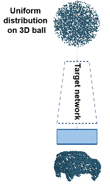
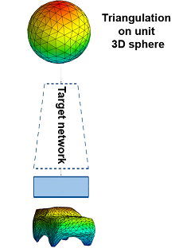

# HyperColor: A HyperNetwork Approach forSynthesizing Auto-colored 3D Models forGame Scenes Population

Authors: Ivan Kostiuk, Przemysław Stachura, Sławomir K. Tadeja, Tomasz Trzci ́nski, and Przemysław Spurek



#### [Hypernetwork approach to generating point clouds](https://arxiv.org/pdf/2003.00802.pdf)

#### Abstract
 Designing a 3D game scene is a tedious task that often requires a substantial amount of work. Typically, this task involvessynthesis, coloring, and placement of 3D models within the game scene. To lessen this workload, we can apply machine learning andother procedural methods to automate some aspects of the game scene development. Earlier research has already tackled generating3D models as well as automated generation of the game scene background with machine learning. However, model auto-coloringremains an underexplored problem. The automatic coloring of a 3D model is a challenging task, especially when dealing with the digitalrepresentation of a colorful, multipart object. In such a case, we have to “understand” the object’s composition and coloring scheme ofeach part. Existing single-stage methods have their own caveats such as the need for segmentation of the object or generating individualparts that have to be assembled together to yield the final model. We address these limitations by proposing a two-stage trainingapproach to synthesize auto-colored 3D models. In the first stage, we obtain a 3D point cloud representing a 3D object, whilst in thesecond stage, we assign colors to points within such cloud. Next, by the means of the “triangulation trick,” we generate a 3D mesh inwhich the surfaces are colored based on interpolation of colored points representing vertices of a given mesh triangle. This approachallows us to generate a smooth coloring scheme. Furthermore, our experimental results suggests that our two-stage approach givesbetter results in terms of shape reconstruction and coloring as compared to traditional single-stage techniques.

## Requirements
- dependencies stored in `requirements.txt`.
- Python 3.8+
- cuda

## Installation
If you are using `Conda`:
- run `./install_requirements.sh` 

otherwise:
- install `cudatoolkit` and run `pip install -r requirements.txt`


### Configuration (settings/hyperparams.json, settings/experiments.json):
  - *arch* -> aae | vae
  - *target_network_input:normalization:type* -> progressive
  - *target_network_input:normalization:epoch* -> epoch for which the progressive normalization, of the points from uniform distribution, ends
  - *reconstruction_loss* -> combined ( champher and MSE )
  - *dataset* -> custom (shapenet with colors)


## Target Network input

#### Uniform distribution:
3D points are sampled from uniform distribution. 

###### Normalization
When normalization is enabled, points are normalized progressively 
from first epoch to `target_network_input:normalization:epoch` epoch specified in the configuration. 

As a result, for epochs >= `target_network_input:normalization:epoch`, target networks input is sampled from a uniform unit 3D ball 

Exemplary config:
```
"target_network_input": {
    "constant": false,
    "normalization": {
        "enable": true,
        "type": "progressive",
        "epoch": 100
    }
}
For epochs: [1, 100] target networsk input is normalized progressively
For epochs: [100, inf] target networks input is sampled from a uniform unit 3D ball
``` 


## Usage
**Add project root directory to PYTHONPATH**

```export PYTHONPATH=project_path:$PYTHONPATH```

### Training
`python experiments/train_vae.py --config settings/hyperparams.json`

Results will be saved in the directory: 
`${results_root}/[aae|vae]/training/uniform*/${dataset}/${classes}`

Model dataset is loaded from path:
  - ${data_dir}
  - This folder should to contain other folders named as follows ["airplane", "car", "chair" ...]
  - Database for above three classes could be downloaded from : https://drive.google.com/drive/folders/14fDCME5hsXv-DoX98sNwtAflriKfG_3n?usp=sharing


### Experiments
`python experiments/experiments.py --config settings/experiments.json`

Results will be saved in the directory: 
`${results_root}/[aae|vae]/experiments/uniform*/${dataset}/${classes}`

Model weights are loaded from path:
  - ${weights_path} if specified
  - otherwise: ${results_root}/${arch}/training/.../weights (make sure that `target_network_input` and `classes` are the
   same in the `hyperparams.json`/`experiments.json`)
  - If you do not want to train model from scratch, you can download weights from : https://drive.google.com/drive/folders/1QIswhEThSbFyZimpepJZ-jpkbgyJwMEm?usp=sharing.
    And unpack this data under ${results_root}. 
    Structure of the path should be like this : ${results_root}/${arch}/training/.../weights
   
###### Sphere distribution:


The following experiments provide input of the target network as samples from a triangulation on a unit 3D sphere: 
- `sphere_triangles` 
- `sphere_triangles_interpolation` 

3D points are sampled uniformly from the triangulation on a unit 3D sphere.

Available methods: `hybrid | hybrid2 | hybrid3 | midpoint | midpoint2 | centroid | edge`

  
### Shapenet dataset classes
Classes can be specified in the hyperparams/experiments file in the **classes** key
```
airplane,  bag,        basket,     bathtub,   bed,        bench, 
bicycle,   birdhouse,  bookshelf,  bottle,    bowl,       bus,      
cabinet,   can,        camera,     cap,       car,        chair,    
clock,     dishwasher, monitor,    table,     telephone,  tin_can,  
tower,     train,      keyboard,   earphone,  faucet,     file,     
guitar,    helmet,     jar,        knife,     lamp,       laptop,   
speaker,   mailbox,    microphone, microwave, motorcycle, mug,      
piano,     pillow,     pistol,     pot,       printer,    remote_control,      
rifle,     rocket,     skateboard, sofa,      stove,      vessel,   
washer,    boat,       cellphone
```
